HECO测试网测试币获取完整教程
=================================

一、MetaMask（小狐狸）钱包安装和使用
---------------------------------------

1、建议使用谷歌浏览器进行操作（下载链接：https://www.google.cn/chrome/）；国内需要自备科学上网；

2、进入到MetaMask官网 https://metamask.io/ 点击 “Download now”按钮下载Chrome版本的插件。

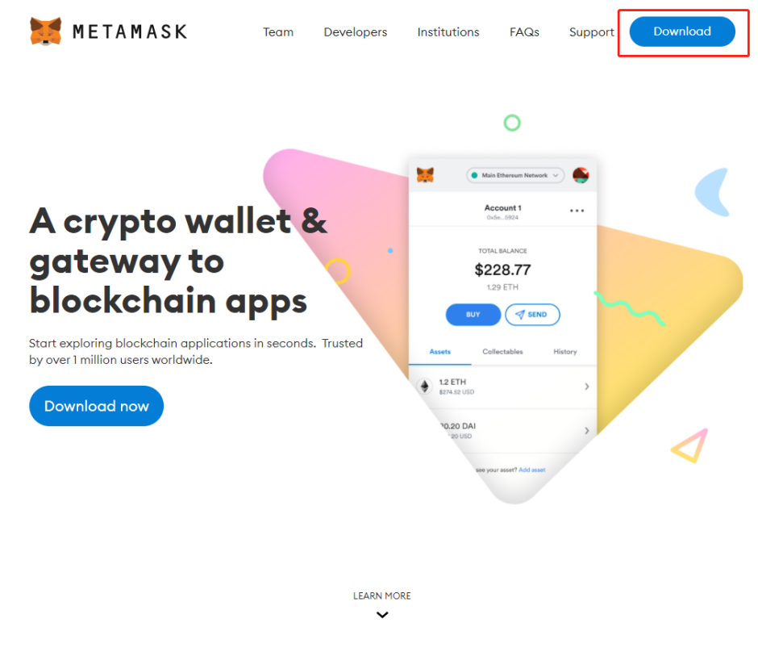

3.页面跳转至此，点击“Install MetaMask for Chrome”；

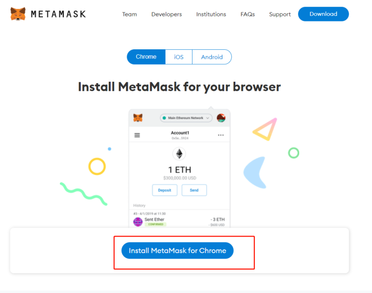

4.点击“添加至Chrome”，添加到谷歌应用里；

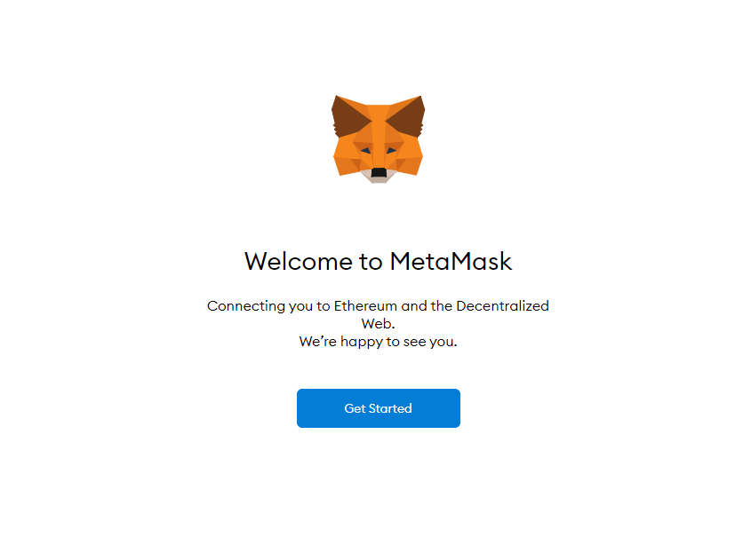

5.点击“添加扩展程序”

6.下载完成之后页面跳转到此，点击“开始使用”；

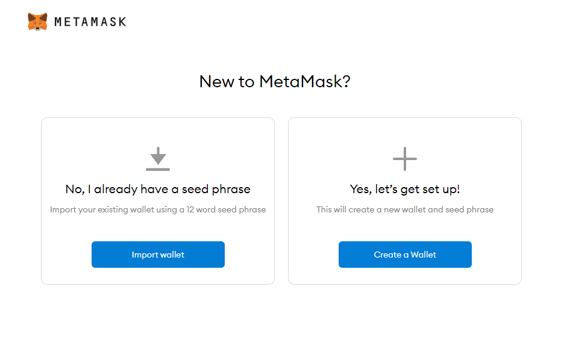

7.可以选着导入已有钱包或者创建新的钱包；（这里以创建新钱包为例）；

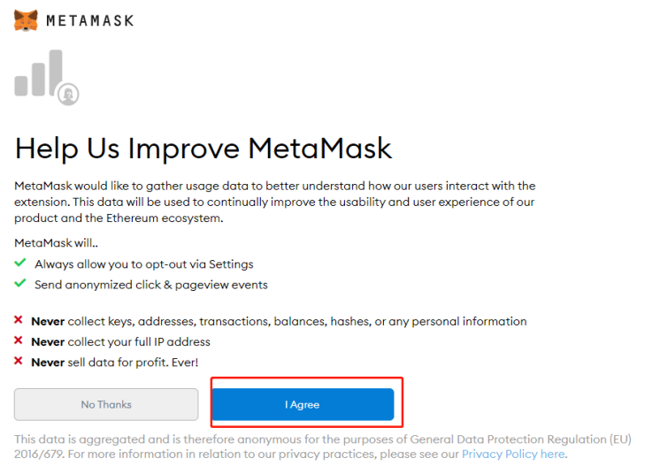

8.认真阅读安全使用规则，点击“I Agree”；（切记勿把私钥透露给别人）

9.创建钱包密码，备份好私钥，到这里你已经注册好MetaMask了！

10.温馨提示：MetaMask在右上角拼图块里可以进行进入。

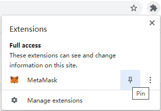

二、GitHub注册
-------------------------------

1.进入GitHub官网（https://github.com/）

2.点击右上角的Sign up进行注册；
.. image:: 9.png

3.创建账户信息；
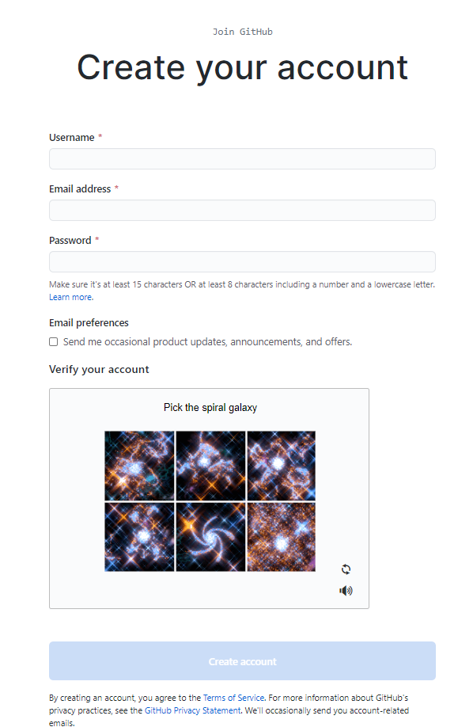

4.选择下一步；
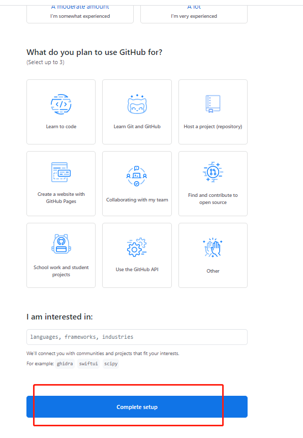

5.创建完成之后需要返回邮箱中验证，才能正常登录GitHub；

三、MetaMask测试RPC网络配置：
-------------------------------
1．要用MetaMask钱包（就是小狐狸钱包），配置下火币生态链测试网，如下图，点击选择“自定义PRC”。
.. image:: 12.png

2.设置自定义网络，点击保存：

网络名称：HECO测试网

新RPC URL：https://http-testnet.hecochain.com

链id： 256

符号：HT

区块浏览器URL：https://scan-testnet.hecochain.com

5.创建完成之后需要返回邮箱中验证，才能正常登录GitHub；

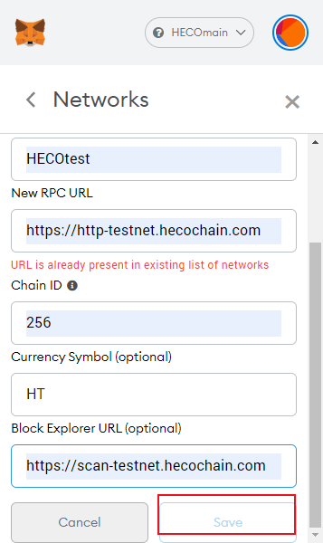

四、HECO测试网水龙头获取测试代币：
------------------------------------

1.在谷歌浏览器中进入测试网代币获取水龙头：
https://scan-testnet.hecochain.com/faucet

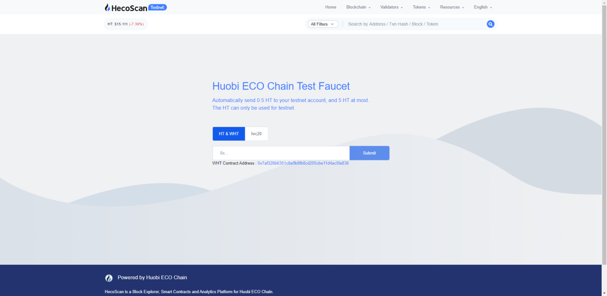

2.在MetaMask界面选择之前配置的HECO测试网, 可以看到：

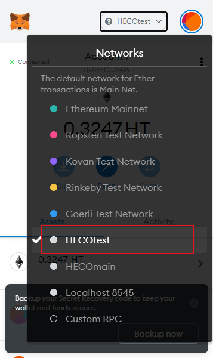

3.钱包左上角会显示未连接；

.. image:: 16.png

4.点击右上角选择更多，点Connected.sites进行站点连接；

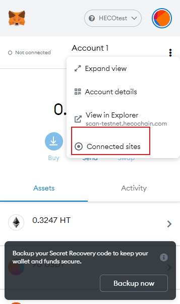

6.选择Manually connect to current site进行手动连接当前站点；

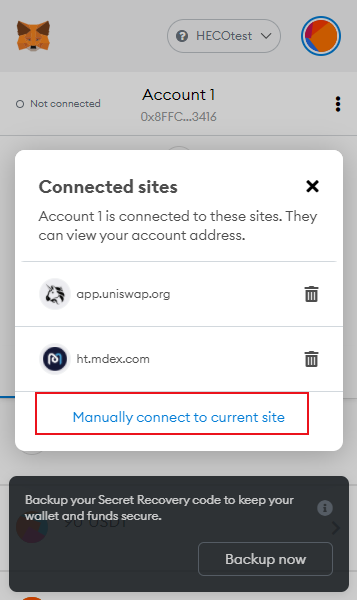

7.连接小狐狸钱包选择下一步；

.. image:: 19.png

8.确认使用此账号进行连接；

.. image:: 20.png

9.页面显示Connected前为绿点则是连接成功；

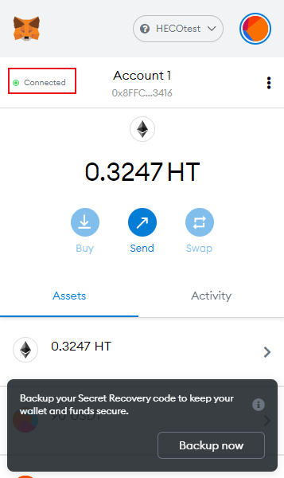

10.返回测试币获取页面，点击GitHub账户进行授权（没有注册的伙伴们需要注册一下GitHub账户）

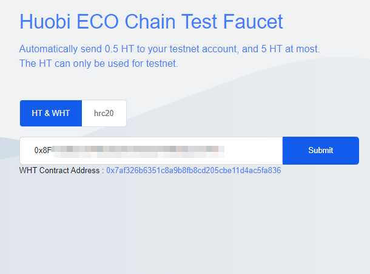

11.点击图中的图标进行身份验证

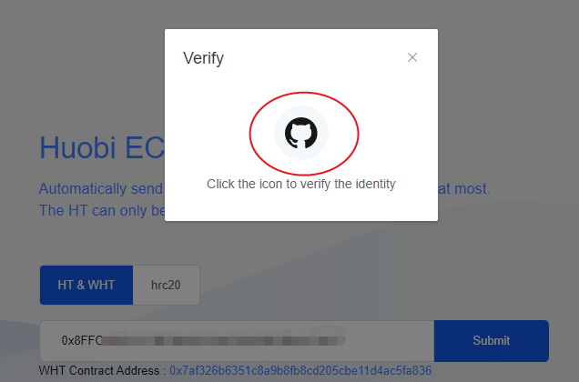

12.GitHub账户进行登录

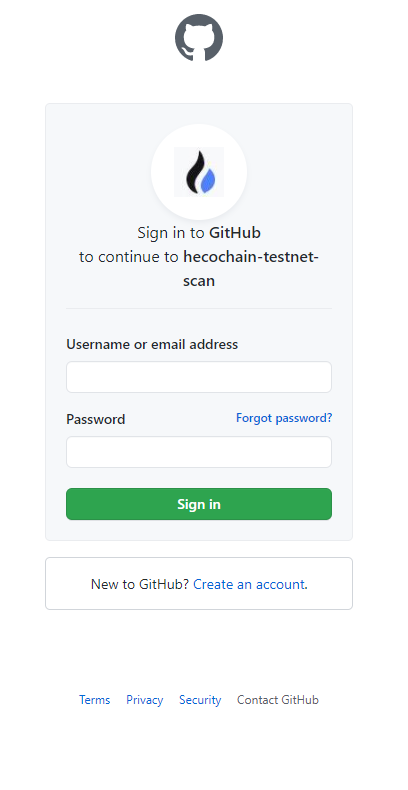

13.复制充币地址到箭头处进行获取测试币

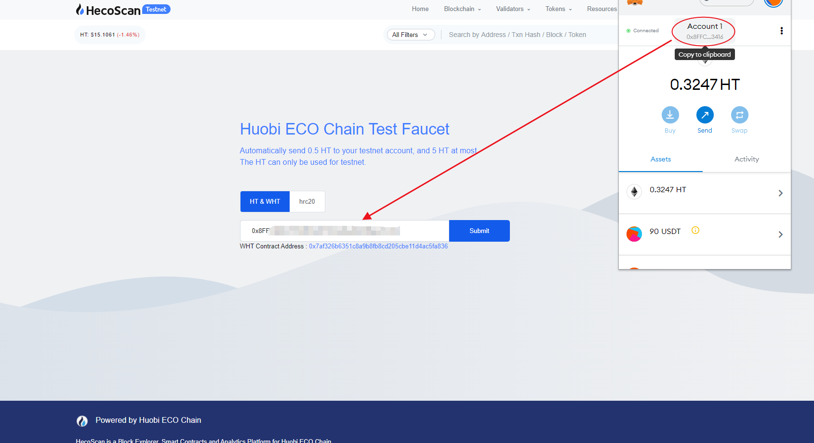
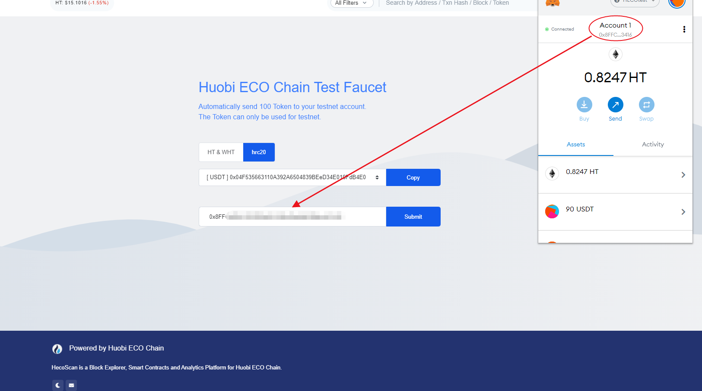

14.在此处以HUSD为例；

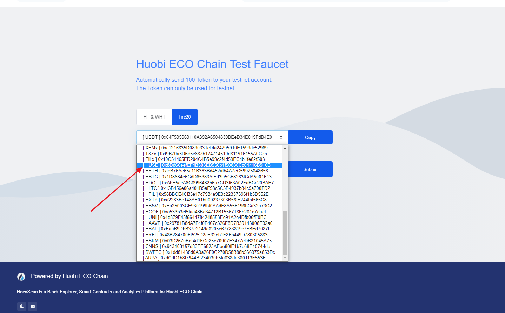

15.点击确定之后测试网会将测试币发送到您的地址里
