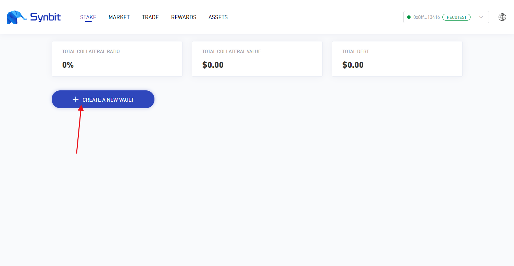
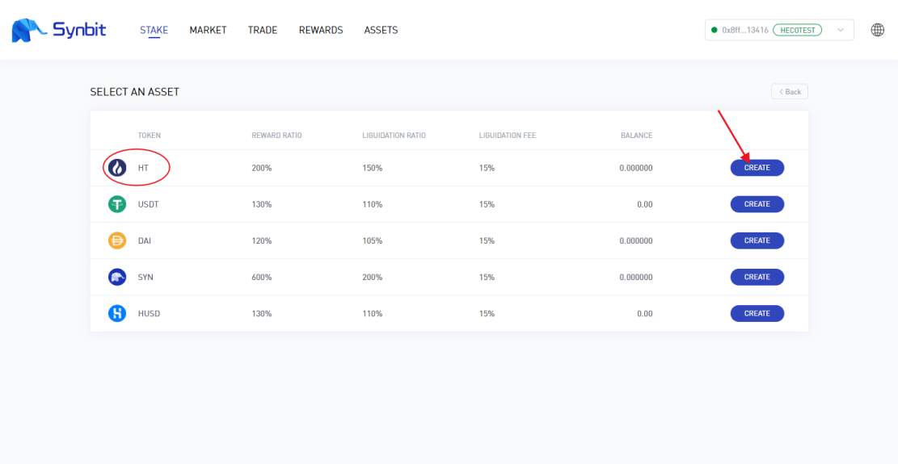
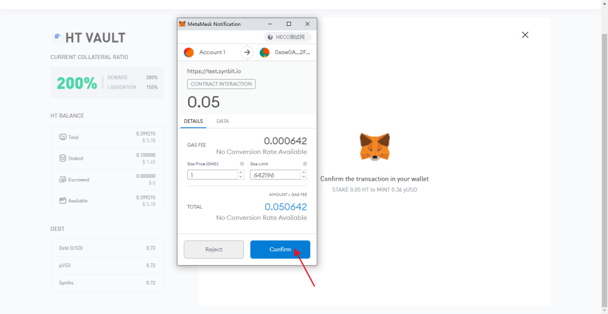

如何在SYNBIT抵押HT（暂时只支持HECO测试网络）
================================================

1.打开Synbit网站www.synbit.io并点击左上角DEMO进入测试页面

.. image:: 35.png

2.在测试页面点击连接钱包

.. image:: 28.png

3.点击创建新金库

4.此处以HT为例，找到HT选项，点击创建

5.在MINT界面填写想要抵押的HT数量，并点击MINT

.. image:: 31.png

6.在弹出的钱包页面点击确认

7.回到浏览器界面，提示转账成功，点击关闭
.. image:: 33.png

8.稍作等待即可在界面右上角看到成功提示
.. image:: 34.png

注：HCEO测试网络的HT获取请参阅我们发布的另一篇文章《How to get token in HECO test network》

