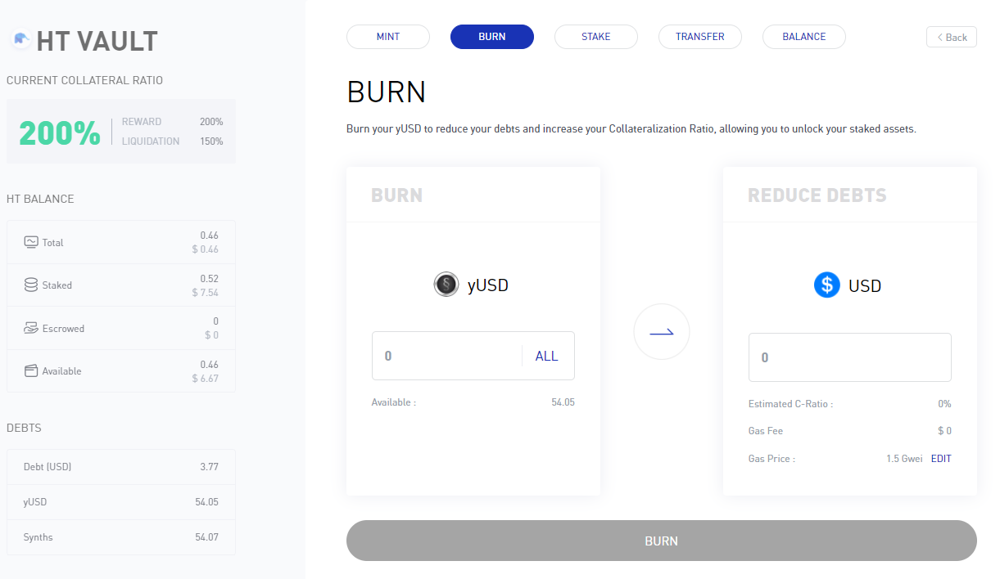
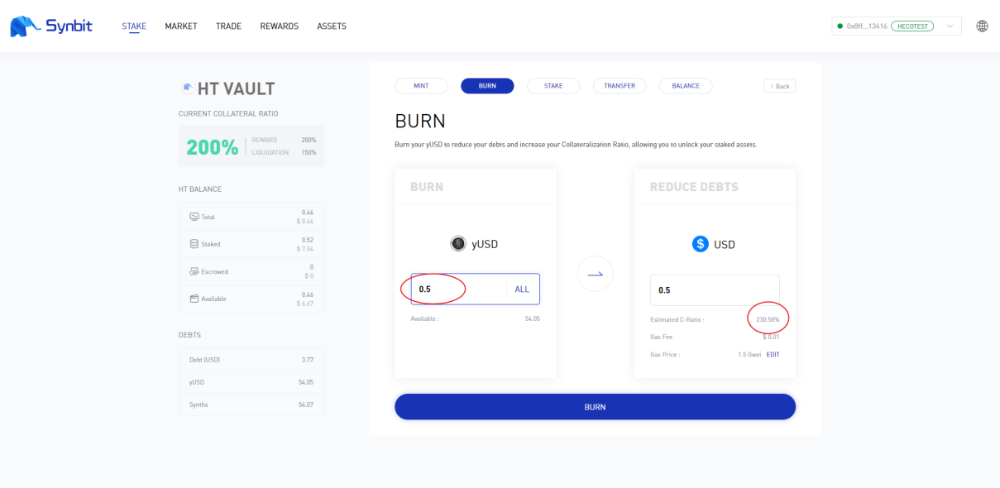
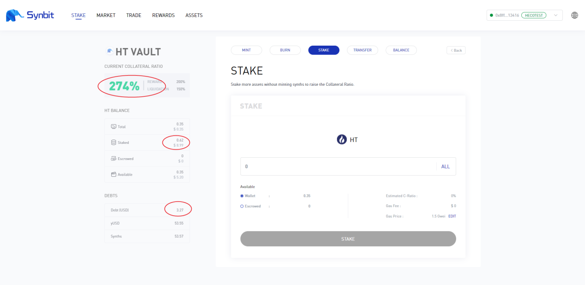
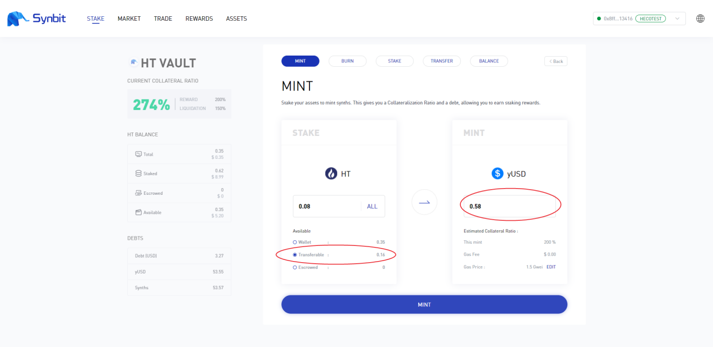
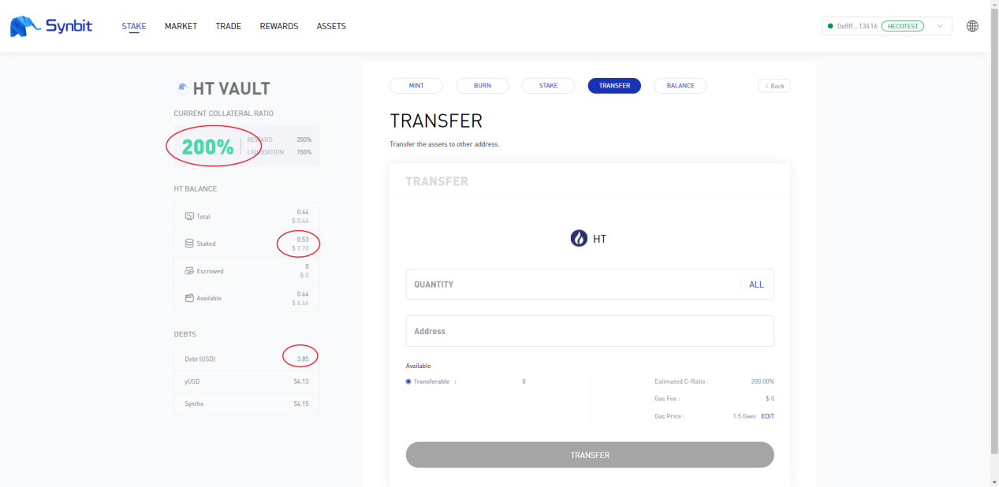

如何调整当前抵押率
========================

一、什么是当前抵押率
-------------------------------

打开Synbit并连接metamask钱包，找到需要调整当前抵押率的抵押资产，此处以HT为例，点击ENTER进入详情页面

.. image:: 36.png

在详情页面左上角红框内可以看到HT的当前抵押率(current collateral ratio)、奖励抵押率(reward collateral ratio)和清算抵押率(liquidation collateral ratio)。

当前抵押率=抵押物价值/债务价值*100%

（以上公式仅针对单一抵押物）

.. image:: 37.png

二、如何提升当前抵押率
-------------------------------

1.为什么要提升当前抵押率？

随着抵押物价格的涨跌，当前抵押率如果低于清算抵押率就会触发清算，低于奖励抵押率将停止获得抵押奖励的SYN。为了避免触发清算以及正常获得抵押奖励，我们需要调整当前抵押率至一个健康的水平。

2.第一种提升当前抵押率的方式

保持抵押物数量不变，通过BURN减少债务来提升当前抵押率，例如下图中，我们的债务是3.77USD，抵押物价值7.54USD，当前抵押率为200%

我们燃烧0.5个yUSD，预计会将当前抵押率提升到230%左右

确认操作之后，我们将当前抵押率提升到了230%，债务减少到3.27USD，抵押物价值不变

.. image:: 40.png

3.第二种提升当前抵押率的方式

保持债务不变，通过STAKE增加抵押物来提升当前抵押率，例如下图中，债务是3.27USD，抵押物价值7.54USD，当前抵押率约为230%

.. image:: 41.png

我们增加0.1个HT作为抵押物，预计会将当前抵押率提升到274.92%

.. image:: 42.png

确认操作之后，当前抵押率提升到了274%，抵押物价值增加到了8.99USD，债务保持不变

三、如何降低当前抵押率
-------------------------------

1.为什么要降低当前抵押率

如果抵押物市价上涨，会导致当前抵押率提升，可能会让当前抵押率远远高于奖励抵押率。当然，这不会导致任何损失，但是过高的当前抵押率相当于降低了资金使用效率，此时我们可以通过操作来降低当前抵押率，提高资金使用效率

2.第一种降低当前抵押率的方式

保持抵押物价值不变，通过发行更多yUSD增加债务，来降低当前抵押率，例如下图中，我们的债务是3.27USD，抵押物价值为8.99USD，当前抵押率为274%

.. image:: 44.png

在MINT界面我们选中使用可转账部分的HT来发行新的yUSD

确认操作后，我们发行了更多yUSD将当前抵押率降低到了233%，债务增加到3.85USD，抵押物价值不变

.. image:: 46.png

3.第二种降低当前抵押率的方式

保持债务不变，通过转账将超过奖励抵押率的抵押物提现到钱包，以此来降低当前抵押率。例如下图中，我们的债务是3.85USD，抵押物价值8.99USD，当前抵押率为233%

.. image:: 47.png

我们将可转账部分的HT全额转账提现，上方填写转账数量，下方填写接收地址，如下图

.. image:: 48.png

确认操作之后，我们将当前抵押率降低到了200%，抵押物价值减少为7.70USD，债务保持不变

至此，你已经学会了所有手动调控抵押率的方式。
