Instruction of Getting Test Coins at HECO Testnet
========================================================================

I. Installation and Use of MetaMask Wallet
--------------------------------------------------------------

1. It is recommended to do the following operations in Google Chrome (download link: https://www.google.cn/chrome/).

2. Enter the official website of MetaMask (https://metamask.io/), click "Download now" to download plug-in of Chrome version.

.. image:: 1.png

3. Jump to this page, click "Install MetaMask for Chrome".

.. image:: 2.png

4. Click "Add to Chrome", to add it to Google Chrome.

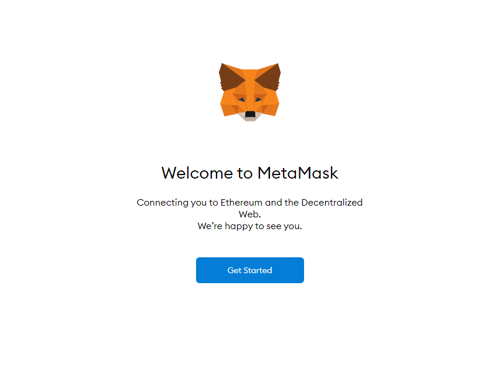

5. Click "Add to Extensions".

6. After downloading, jump to this page, click "Get Started"

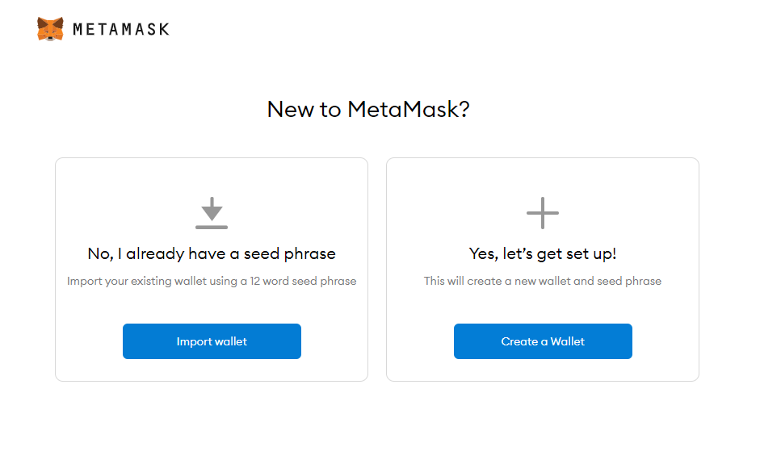

7. You can decide to import an existing wallet or create a new wallet; (Here is an example of creating a new wallet)

.. image:: 6.png

8. Carefully read the safe operation rules, and click "I Agree" (do not disclose the private key to others).

.. image:: 7.png

9. Create a password for a wallet, and back up your private key, now you have registered MetaMask!

10. Notes: MetaMask is accessible from the puzzle block in the upper right corner.

.. image:: 8.png

II. GitHub Registration
-------------------------------

1. Enter the official website of GitHub (https://github.com/)

2. Click the Sign up in the upper right corner for registration.

3. Create an account.

.. image:: 10.png

4. Select "Next".

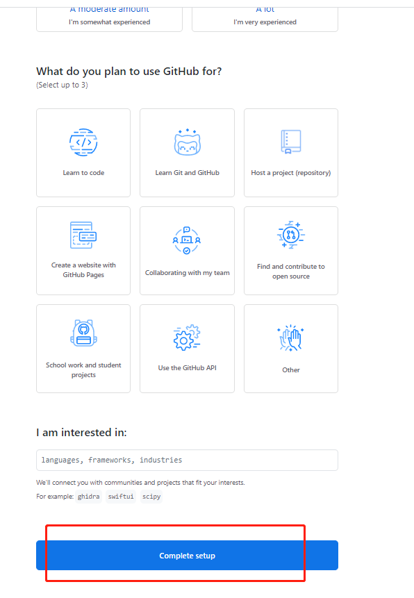

5. After creating the account, you need to return to the mailbox for verification, and then you can log in to GitHub normally.

III. MetaMask Tests RPC Network Configuration
--------------------------------------------------------------

1. To use the MetaMask Wallet, the Huobi ECO Chain Testnet is required, as shown in the following picture, please click "Custom PRC".

.. image:: 12.png

2. Set up the custom network, click "Save"

Network Name: HECO Testnet

New RPC URL: https://http-testnet.hecochain.com

Chain ID:  256

Currency Symbol (optional): HT

Block Explorer URL (optional): https://scan-testnet.hecochain.com

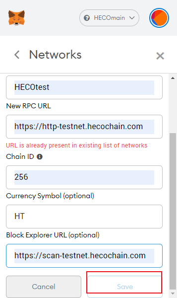

IV. Acquisition of Test Coins at HECO Test Faucet
--------------------------------------------------------------

1. Enter HECO Test Faucet in Google Chrome:

https://scan-testnet.hecochain.com/faucet

.. image:: 14.png

2. After selecting the HECO Testnet previously configured in the MetaMask interface, you can see the following figure.

.. image:: 15.png

3. "Not connected" will be displayed in the upper left corner of the wallet.

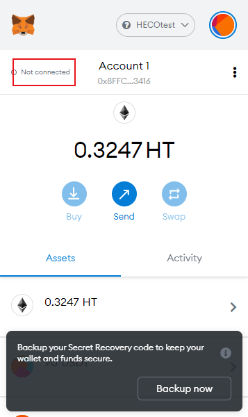

4. Click "More" in the upper right corner, and click "Connected.sites" to connect to sites.

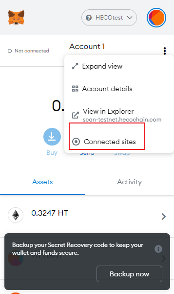

6. Select "Manually connect to current site" to manually connect to the current site.

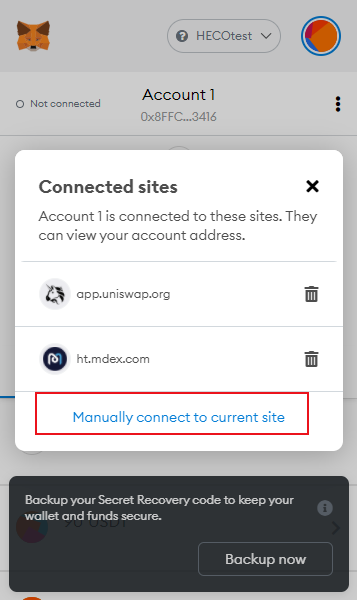

7. Connect to MetaMask Wallet and select "Next".

.. image:: 19.png

8. Confirm that you will use this account to connect.

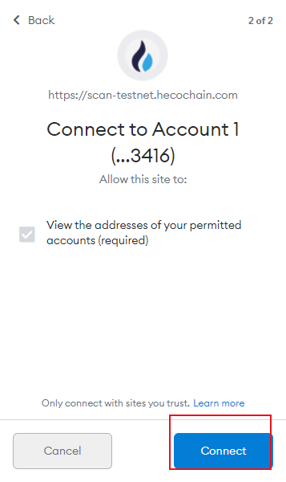

9. The green dot in front of "Connected" indicates a successful connection.

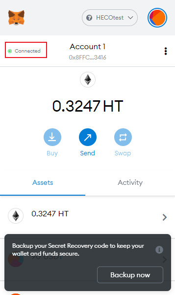

10. Return to the test coin acquisition page, and click the GitHub account for getting authorization (if you are not registered, please register a GitHub account)

.. image:: 22.png

11. Click the icon in the picture for identity verification

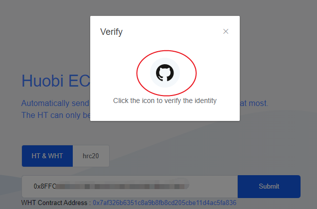

12. Log in to your GitHub account

.. image:: 24.png

13. Copy the charging address to the arrow to get test coins

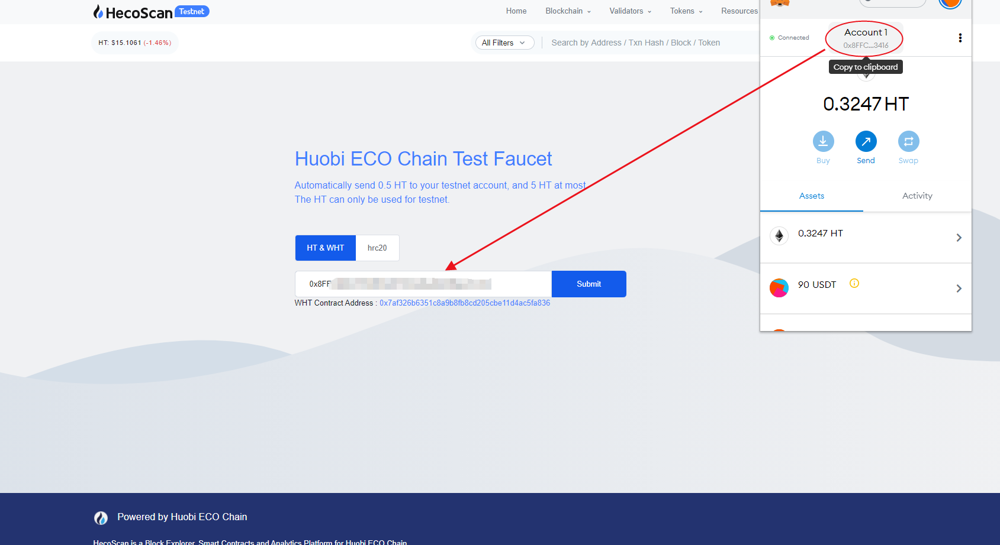
.. image:: 26.png

14. HUSD as an example here

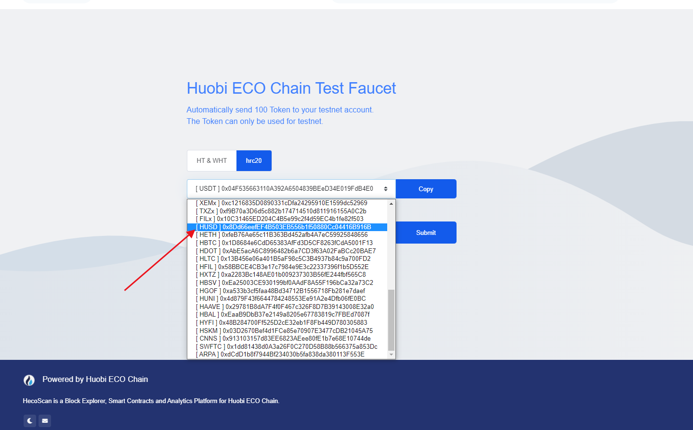

15. After clicking "Submit", the Testnet will send the test coins to your address
