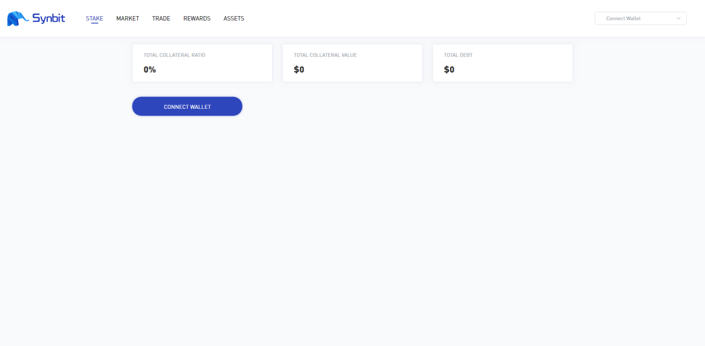
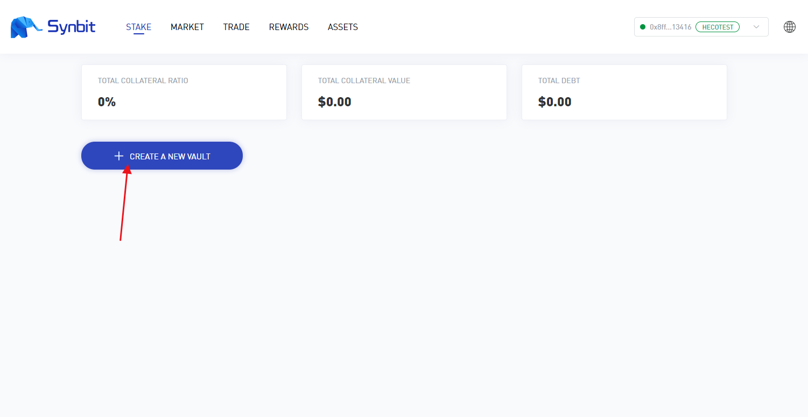
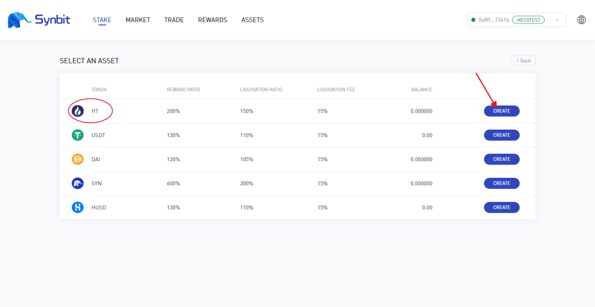
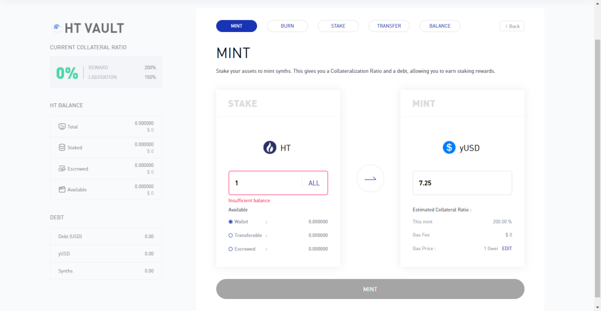
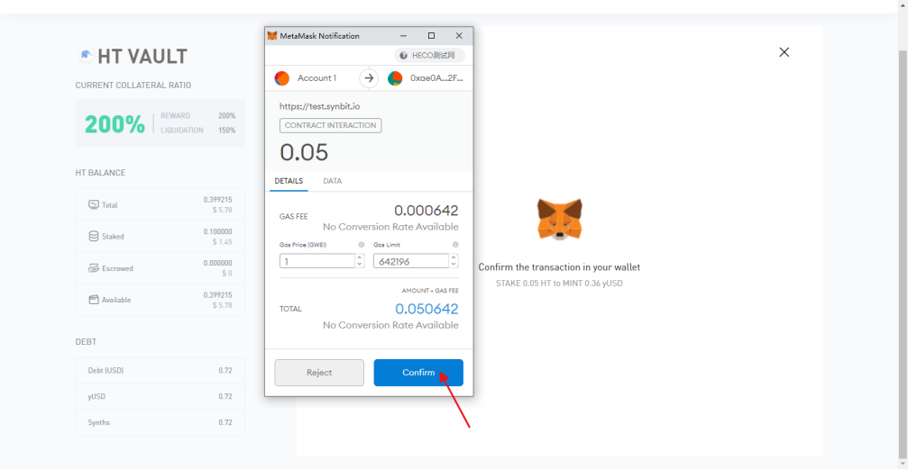
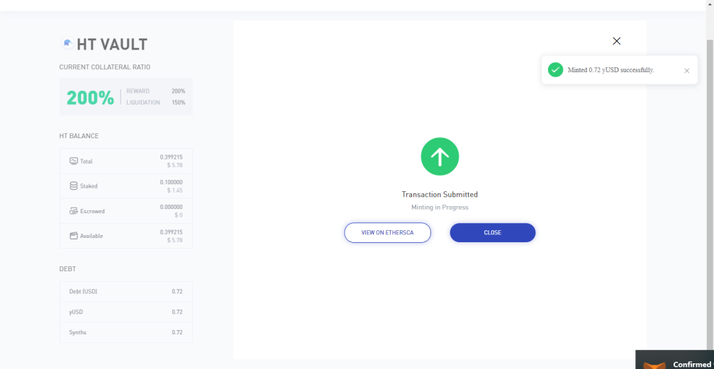
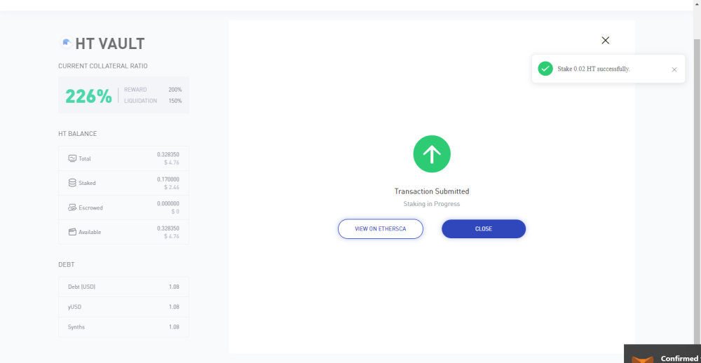

How to stake HT at SYNBIT (Temporarily only supports HuoBi ECO Chain test network)
================================================================================================

1. Open the Synbit website www.synbit.io and click DEMO to enter the test page

2.Click Connect Wallet on the test page

3. Click Create a New Vault

4. Here is an example of HT, find the HT option and click Create

5. Fill in the number of HT you want to pledge in the MINT interface and click MINT

6. Click Confirm in the pop-up wallet page

7. Return to the browser interface, prompting the successful transfer, click Close

8.Wait a little to see the success prompt in the upper right corner of the interface

P.S. For HT in HECO test network, please refer to our other article "How to get token in HECO test network".
