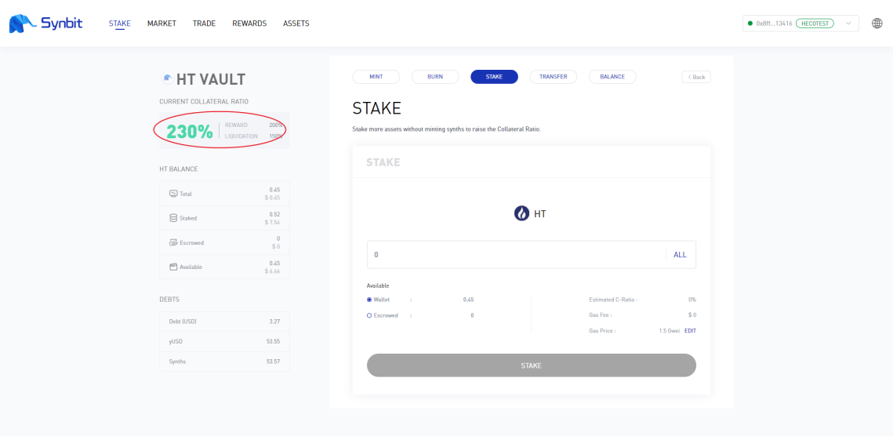

How To Adjust the current collateral ratio?
================================================

I. What is the current collateral ratio?
--------------------------------------------------------------

Open Synbit and connect metamask wallet, and find the mortgage assets that requires adjustment of the current collateral ratio. Here, take HT as an example, click ENTER to enter the details page

.. image:: 36.png

In the red box at the top left corner of the details page you can see the current collateral ratio, reward collateral ratio, and liquidation collateral ratio for the HT.

Current collateral ratio = collateral value/debt value * 100%
(The above formula is only for a single collateral)

II. How to raise the current collateral ratio?
--------------------------------------------------------------

1. Why raise the current collateral ratio?

With the rise and fall of collateral price, if the current collateral ratio is lower than the liquidation collateral ratio, the liquidation will be triggered and if lower than the reward collateral ratio, SYN will cease to receive the collateral reward. We need to adjust the current collateral ratio to a normal level in order to avoid triggering a liquidation and to receive the collateral award normally.

2. The first method to raise the current collateral ratio

Keep the collateral quantity unchanged, and reduce debt by BURN to raise the current collateral ratio. As shown in the following figure, our debt is 3.77 USD, and the collateral value is 7.54 USD, so the current collateral ratio is 200%

.. image:: 38.png

We burn 0.5*yUSD, which is expected to raise the current collateral ratio to about 230%

.. image:: 39.png

After confirming the operation, we raised the current collateral ratio to 230%, reduced the debt to 3.27 USD, and the collateral value remained unchanged

3. The second method to raise the current collateral ratio

Keep the debt unchanged, and increase collateral by STAKE to raise the current collateral ratio. For example, in the following figure, our debt is 3.27 USD, and the collateral value is 7.54 USD, so the current collateral ratio is 230%

We add 0.1*HT as collateral, which is expected to raise the current collateral ratio to 274.92%

After confirming the operation, the current collateral ratio was increased to 274%, the collateral value raised to 8.99 USD, and the debt remained unchanged

.. image:: 43.png

III. How to reduce the current collateral ratio?
--------------------------------------------------------------

1. Why reduce the current collateral ratio?

An increase in the market value of the collateral would result in an increase in the current collateral ratio, which could make the current collateral ratio much higher than the reward collateral ratio. Of course, this will not lead to any loss, but a high current collateral ratio is equivalent to a reduction in the efficiency of funds using. At this time, we can reduce the current collateral ratio to improve the efficiency of the funds using

2. The first method to reduce the current collateral ratio
Keep the collateral value unchanged, and increase debt by issuing more yUSD to reduce the current collateral ratio. For example, in the following figure, our debt is 3.27 USD, and the collateral value is 8.99 USD, so the current collateral ratio is 274%

In the MINT interface we selected the HT of the transferable part to issue the new yUSD

.. image:: 45.png

After confirming the operation, we issued more yUSD, reducing the current collateral ratio to 2303%, increasing the debt to 3.85 USD, and the collateral value remained unchanged

3. The second method to reduce the current collateral ratio

Keep the debt unchanged, and withdraw the collateral with exceeded reward collateral ratio to the wallet through transfer, to reduce the current collateral ratio. For example, in the following figure, our debt is 3.85 USD, and the collateral value is 8.99 USD, so the current collateral ratio is 233%

.. image:: 47.png

We will transfer and withdraw the full amount of HT that can be transferred. Please fill in the transfer amount at the top and the receiving address at the bottom, as shown in the following figure

After confirming the operation, the current collateral ratio was reduced to 274%, the collateral value reduced to 8.99 USD, and the debt remained unchanged

.. image:: 49.png

So far, you have learned all the ways to manually control the collateral ratio.
